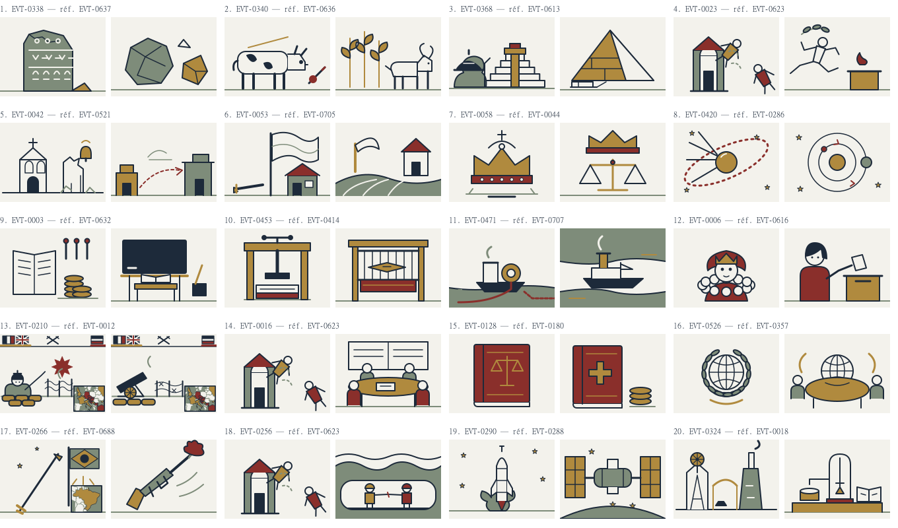

# Lot pilote : 20 illustrations pédagogiques

Référence : issue #11, lots des PR #41, #43 et #46, décision de docs/prd.md et système livré par #22 / PR #64. Base de comparaison : les **100 SVG de content/illustrations/** sur main (6a566d9), examinés sur quatre planches avant de dessiner. Les cinq SVG de docs/illustrations/ sont les esquisses de décision, pas le stock final : leur README précise que les rendus restaient à unifier. L’artefact externe de la charte lié dans CLAUDE.md n’était pas accessible ; aucune règle supplémentaire n’en a été déduite.

## Audit rapide de la DA validée

| Aspect | Observation et règle appliquée |
| --- | --- |
| Cadrage | Rectangle 4:3 de 160 × 120 ; sujet entier, centré ou deux objets en vis-à-vis ; ligne de sol vers 106–110 quand utile. |
| Simplicité | Une idée par dessin, identifiée par silhouette ; pas de scène naturaliste. |
| Densité | Quelques contours internes fonctionnels ; livres, roues et façades ont peu de divisions. Les cartes de guerre sont l’exception plus dense. |
| Palette | Papier, encre, laiton, oxyde, sauge uniquement ; couleurs en aplats, pas de couleurs naturelles ajoutées. |
| Trait | Contour principal 2 px, cap/join round ; détails souvent 1–1,5 px, accent mécanique/hampe jusqu’à 3–4 px. La scène de bataille à 0,72 compense le trait à 2,8 px. |
| Formes | Rectangles, cercles, ellipses, triangles, courbes courtes ; angles et volumes décrits par le contour. |
| Ombres | Aucune ombre portée, lumière, dégradé ou texture. Des faces d’objets peuvent avoir des aplats distincts sans effet de lumière. |
| Abstraction | Emblèmes concrets ou associations de deux objets ; pas de recherche d’originalité ou de portrait réaliste. |
| Personnages / objets / architecture | Têtes rondes et corps géométriques (EVT-0623), visages très simples (EVT-0616), mécanique réduite à ses pièces utiles (EVT-0018/0414), portes et toits sans décor. |
| Fond et composition | Fond papier opaque, ciel généralement vide, sol sauge ; batailles : bandeau de 19 px, scène réduite, petite carte de 46 × 38 en bas à droite. |

## Comment j’ai respecté la DA existante

- Même enveloppe que les 100 SVG validés : 160 × 120, fond papier opaque #f3f2ec, contour encre #1d2a3a de 2 px, extrémités et jonctions arrondies.
- Aplats uniquement : laiton #b08a3e, oxyde #8a2f2b, sauge #7e8c7a ; aucun texte, dégradé, ombre, texture, filtre ou image intégrée.
- Un sujet principal, quelques accessoires, espace vide ; cercles, rectangles et chemins courts, sans modelé ni détail décoratif ajouté.
- Même abstraction : têtes rondes, torses géométriques, membres au trait ; objets et bâtiments réduits à leur silhouette utile.
- Détails secondaires à 1–1,5 px et accents ponctuels à 3–4 px, comme dans le stock. Ligne de sol sauge et astres à cinq branches repris quand le sujet s’y prête.
- Pour la Somme, bandeau de drapeaux, armes croisées, carte d’Europe et cadrage repris du SVG de 1914 ; seule la scène devient une artillerie devant les barbelés. Aucun SVG validé n’est modifié.

## Sélection et correspondances

325 cartes au départ : 51 utilisaient l’un des SVG validés, **274** un motif. Les 20 cartes pilotes représentent 20 événements distincts sans SVG, dans **17 chapitres**, du CM2 à la terminale HGGSP.

La sélection favorise les objets, gestes et infrastructures qui rendent une notion scolaire immédiatement concrète : pierre taillée, culture/élevage, pyramide, pratique religieuse et sportive, justice, astronomie, école, tissage, canal, vote, guerre industrielle, coordination clandestine, solidarité, diplomatie, démocratisation, coopération technique et mesure scientifique. Elle traverse Préhistoire/Antiquité (4), Moyen Âge/Renaissance (4), XIXe siècle (école, canuts, Suez, polonium), XXe siècle (vote, Somme, CNR, Sécurité sociale, Bandung, Portugal, tunnel, Zarya). Les reprises dans plusieurs chapitres augmentent l’utilité du lot sans créer de dessin supplémentaire.

| card_id | event_id | Titre | Illustration existante ? | Nouveau SVG |
| --- | --- | --- | --- | --- |
| CARD-004-outils-pierre | EVT-0338 | Fabriquer des outils de pierre | non | [EVT-0338.svg](../../content/illustrations/EVT-0338.svg) |
| CARD-004-agriculture | EVT-0340 | Cultiver et élever des animaux | non | [EVT-0340.svg](../../content/illustrations/EVT-0340.svg) |
| CARD-004-pyramide | EVT-0368 | Une pyramide montre la puissance du pharaon | non | [EVT-0368.svg](../../content/illustrations/EVT-0368.svg) |
| CARD-005-olympie | EVT-0023 | Olympie : un sanctuaire commun aux Grecs | non | [EVT-0023.svg](../../content/illustrations/EVT-0023.svg) |
| CARD-007-hegire | EVT-0042 | L’hégire : une communauté s’organise | non | [EVT-0042.svg](../../content/illustrations/EVT-0042.svg) |
| CARD-009-campagnes-medievales | EVT-0053 | Les campagnes nourrissent une population croissante | non | [EVT-0053.svg](../../content/illustrations/EVT-0053.svg) |
| CARD-010-louis-ix | EVT-0058 | Louis IX affirme une justice royale | non | [EVT-0058.svg](../../content/illustrations/EVT-0058.svg) |
| CARD-011-copernic | EVT-0420 | Repenser la place de la Terre | non | [EVT-0420.svg](../../content/illustrations/EVT-0420.svg) |
| CARD-001-ecole-gratuite | EVT-0003 | L’école publique devient gratuite | non | [EVT-0003.svg](../../content/illustrations/EVT-0003.svg) |
| CARD-002-canuts | EVT-0453 | Les ouvriers de la soie se révoltent | non | [EVT-0453.svg](../../content/illustrations/EVT-0453.svg) |
| CARD-014-suez-echanges | EVT-0471 | Le canal de Suez rapproche les routes maritimes | non | [EVT-0471.svg](../../content/illustrations/EVT-0471.svg) |
| CARD-001-citoyennete-femmes | EVT-0006 | Les femmes obtiennent le droit de vote | non | [EVT-0006.svg](../../content/illustrations/EVT-0006.svg) |
| CARD-027-somme-guerre-usure | EVT-0210 | La Somme illustre la guerre d’usure industrielle | non | [EVT-0210.svg](../../content/illustrations/EVT-0210.svg) |
| CARD-016-cnr | EVT-0016 | Le CNR : unir les résistances | non | [EVT-0016.svg](../../content/illustrations/EVT-0016.svg) |
| CARD-018-securite-sociale | EVT-0128 | La Sécurité sociale organise une protection collective | non | [EVT-0128.svg](../../content/illustrations/EVT-0128.svg) |
| CARD-017-bandung-voix-nouvelles | EVT-0526 | À Bandung, de nouveaux États affirment leur place | non | [EVT-0526.svg](../../content/illustrations/EVT-0526.svg) |
| CARD-030-portugal-democratisation | EVT-0266 | La révolution portugaise ouvre une transition démocratique | non | [EVT-0266.svg](../../content/illustrations/EVT-0266.svg) |
| CARD-031-manche-cooperation | EVT-0256 | Le tunnel sous la Manche matérialise une coopération entre États | non | [EVT-0256.svg](../../content/illustrations/EVT-0256.svg) |
| CARD-041-iss-cooperation | EVT-0290 | L’ISS montre qu’une coopération peut survivre aux rivalités | non | [EVT-0290.svg](../../content/illustrations/EVT-0290.svg) |
| CARD-046-polonium-recherche | EVT-0324 | La découverte du polonium associe mesure et interprétation | non | [EVT-0324.svg](../../content/illustrations/EVT-0324.svg) |

Les mêmes événements illustrent automatiquement cinq autres cartes via la correspondance canonique existante :

- CARD-003-resistance-unie → EVT-0016
- CARD-014-canuts-conflit-social → EVT-0453
- CARD-015-ecole-gratuite → EVT-0003
- CARD-018-vote-femmes → EVT-0006
- CARD-036-portugal-transition → EVT-0266

**Bilan : 20 nouveaux SVG, 25 cartes couvertes dans 20 chapitres, 249 motifs restants.** Le CSV pilote est un inventaire de relecture/tests, pas une deuxième table de routage.

## Branchement

Les fichiers restent à l’emplacement attendu : content/illustrations/EVT-xxxx.svg. illustrationCarte(card_id) lit déjà la correspondance interne de content/pedagogie/cartes-v1.csv, trouve le SVG et le sert par /api/pedagogie/illustration/[cardId]. Le composant de /apprendre utilise déjà cette URL. Le glob outputFileTracingIncludes existant embarque les 20 fichiers dans le bundle de production, contrôlé dans le manifeste Next. Aucune modification de composant, de CSV canonique, de route ou de configuration nécessaire ; aucun identifiant EVT exposé au navigateur.

Aucun envoi Storage, import, migration, modification de base ou de production. Le lot se consulte dans l’aperçu de la PR ; sa validation graphique reste à faire avant fusion.

## Relecture manuelle

Chaque paire montre **la référence validée à gauche et le nouveau SVG à droite**, à 160 × 120, dans l’ordre du tableau. La référence porte sur les formes et la facture, pas nécessairement sur le même sujet historique.

| Événement | Stock validé à comparer | Lot pilote |
| --- | --- | --- |
| EVT-0338 | [Référence EVT-0637.svg](../../content/illustrations/EVT-0637.svg) | [Nouveau dessin](../../content/illustrations/EVT-0338.svg) |
| EVT-0340 | [Référence EVT-0636.svg](../../content/illustrations/EVT-0636.svg) | [Nouveau dessin](../../content/illustrations/EVT-0340.svg) |
| EVT-0368 | [Référence EVT-0613.svg](../../content/illustrations/EVT-0613.svg) | [Nouveau dessin](../../content/illustrations/EVT-0368.svg) |
| EVT-0023 | [Référence EVT-0623.svg](../../content/illustrations/EVT-0623.svg) | [Nouveau dessin](../../content/illustrations/EVT-0023.svg) |
| EVT-0042 | [Référence EVT-0521.svg](../../content/illustrations/EVT-0521.svg) | [Nouveau dessin](../../content/illustrations/EVT-0042.svg) |
| EVT-0053 | [Référence EVT-0705.svg](../../content/illustrations/EVT-0705.svg) | [Nouveau dessin](../../content/illustrations/EVT-0053.svg) |
| EVT-0058 | [Référence EVT-0044.svg](../../content/illustrations/EVT-0044.svg) | [Nouveau dessin](../../content/illustrations/EVT-0058.svg) |
| EVT-0420 | [Référence EVT-0286.svg](../../content/illustrations/EVT-0286.svg) | [Nouveau dessin](../../content/illustrations/EVT-0420.svg) |
| EVT-0003 | [Référence EVT-0632.svg](../../content/illustrations/EVT-0632.svg) | [Nouveau dessin](../../content/illustrations/EVT-0003.svg) |
| EVT-0453 | [Référence EVT-0414.svg](../../content/illustrations/EVT-0414.svg) | [Nouveau dessin](../../content/illustrations/EVT-0453.svg) |
| EVT-0471 | [Référence EVT-0707.svg](../../content/illustrations/EVT-0707.svg) | [Nouveau dessin](../../content/illustrations/EVT-0471.svg) |
| EVT-0006 | [Référence EVT-0616.svg](../../content/illustrations/EVT-0616.svg) | [Nouveau dessin](../../content/illustrations/EVT-0006.svg) |
| EVT-0210 | [Référence EVT-0012.svg](../../content/illustrations/EVT-0012.svg) | [Nouveau dessin](../../content/illustrations/EVT-0210.svg) |
| EVT-0016 | [Référence EVT-0623.svg](../../content/illustrations/EVT-0623.svg) | [Nouveau dessin](../../content/illustrations/EVT-0016.svg) |
| EVT-0128 | [Référence EVT-0180.svg](../../content/illustrations/EVT-0180.svg) | [Nouveau dessin](../../content/illustrations/EVT-0128.svg) |
| EVT-0526 | [Référence EVT-0357.svg](../../content/illustrations/EVT-0357.svg) | [Nouveau dessin](../../content/illustrations/EVT-0526.svg) |
| EVT-0266 | [Référence EVT-0688.svg](../../content/illustrations/EVT-0688.svg) | [Nouveau dessin](../../content/illustrations/EVT-0266.svg) |
| EVT-0256 | [Référence EVT-0623.svg](../../content/illustrations/EVT-0623.svg) | [Nouveau dessin](../../content/illustrations/EVT-0256.svg) |
| EVT-0290 | [Référence EVT-0288.svg](../../content/illustrations/EVT-0288.svg) | [Nouveau dessin](../../content/illustrations/EVT-0290.svg) |
| EVT-0324 | [Référence EVT-0018.svg](../../content/illustrations/EVT-0018.svg) | [Nouveau dessin](../../content/illustrations/EVT-0324.svg) |

1. Ouvrir la planche à 100 %, puis les SVG voisins : comparer contour, palette, poids des aplats, taille des sujets, espace vide et quantité de détails. Aucune impression de dessin plus réaliste ou plus décoratif ne doit apparaître.
2. Sur l’aperçu de PR, ouvrir chaque route ci-dessous et cliquer la carte indiquée ; retrouver le dessin du tableau, puis parcourir Précédente/Suivante pour le comparer à une illustration ancienne et à un motif restant.
3. Refaire l’ouverture de l’école, du vote, de la Somme et de Zarya à 375 px ; vérifier dessin entier, proportions 4:3 et lecture sans grossissement.
4. Contrôler une carte validée inchangée (CARD-024-bastille-mobilisation) et une carte encore sans dessin (CARD-016-verdun) ; les fonctions de navigation doivent rester identiques.
5. Accorder une attention particulière aux réserves ci-dessous ; la conformité SVG/tests ne remplace pas l’avis visuel de Maxou et Antonin.

| Carte | Route sur l’aperçu de la PR |
| --- | --- |
| CARD-004-outils-pierre | `/apprendre/6e/thm-004-theme-1-la-longue-histoire-de-l-humanite-et-des-migrations` |
| CARD-004-agriculture | `/apprendre/6e/thm-004-theme-1-la-longue-histoire-de-l-humanite-et-des-migrations` |
| CARD-004-pyramide | `/apprendre/6e/thm-004-theme-1-la-longue-histoire-de-l-humanite-et-des-migrations` |
| CARD-005-olympie | `/apprendre/6e/thm-005-theme-2-recits-fondateurs-croyances-et-citoyennete-dans-la-mediterranee-antique` |
| CARD-007-hegire | `/apprendre/5e/thm-007-theme-1-chretientes-et-islam-vie-xiiie-siecles-des-mondes-en-contact` |
| CARD-009-campagnes-medievales | `/apprendre/5e/thm-009-theme-2-societe-eglise-et-pouvoir-politique-dans-l-occident-feodal-xie-xve-siecles` |
| CARD-010-louis-ix | `/apprendre/5e/thm-010-autres-evenements-directement-exploitables-pour-le-theme-2` |
| CARD-011-copernic | `/apprendre/5e/thm-011-theme-3-transformations-de-l-europe-et-ouverture-sur-le-monde-aux-xvie-et-xviie-siecles` |
| CARD-001-ecole-gratuite | `/apprendre/cm2/thm-001-theme-1-le-temps-de-la-republique` |
| CARD-002-canuts | `/apprendre/cm2/thm-002-theme-2-l-age-industriel-en-france` |
| CARD-014-suez-echanges | `/apprendre/4e/thm-014-theme-2-l-europe-et-le-monde-au-xixe-siecle` |
| CARD-001-citoyennete-femmes | `/apprendre/cm2/thm-001-theme-1-le-temps-de-la-republique` |
| CARD-027-somme-guerre-usure | `/apprendre/premiere/thm-027-theme-4-la-premiere-guerre-mondiale-le-suicide-de-l-europe-et-la-fin-des-empires-europeens` |
| CARD-016-cnr | `/apprendre/3e/thm-016-theme-1-l-europe-un-theatre-majeur-des-guerres-totales-1914-1945` |
| CARD-018-securite-sociale | `/apprendre/3e/thm-018-theme-3-francaises-et-francais-dans-une-republique-repensee` |
| CARD-017-bandung-voix-nouvelles | `/apprendre/3e/thm-017-theme-2-le-monde-depuis-1945` |
| CARD-030-portugal-democratisation | `/apprendre/terminale/thm-030-theme-3-les-remises-en-cause-economiques-politiques-et-sociales-des-annees-1970-a-1991` |
| CARD-031-manche-cooperation | `/apprendre/terminale/thm-031-theme-4-le-monde-l-europe-et-la-france-depuis-les-annees-1990-entre-cooperations-et-conflits` |
| CARD-041-iss-cooperation | `/apprendre/terminale-hggsp/thm-041-theme-1-de-nouveaux-espaces-de-conquete` |
| CARD-046-polonium-recherche | `/apprendre/terminale-hggsp/thm-046-theme-6-l-enjeu-de-la-connaissance` |

## Choix historiques et points à relire

- **Lomekwi** : blocs et éclat taillés, aucune hache polie ni manche. Le [MNHN](https://www.mnhn.fr/fr/qu-est-ce-que-les-premiers-hommes-ont-laisse-derriere-eux) décrit un outillage rudimentaire obtenu notamment par fracturation sur enclume ; le dessin ne prétend pas reproduire un artefact précis.
- **Olympie** : athlète schématique, rameau d’olivier et autel ; pas d’anneaux modernes ni de reconstruction du temple de Zeus à une date antérieure à sa construction. La silhouette en mouvement est un point de comparaison prioritaire avec EVT-0623.
- **Hégire** : déplacement entre deux habitats schématiques ; aucune représentation de Muhammad, ni minaret ou mosquée monumentalement tardifs. Les lieux ne sont pas une reconstruction de La Mecque ou de Médine.
- **Louis IX** : couronne et balance signifient la justice royale ; aucune mise en scène inventée sous un chêne. **Vote des femmes** : tenue et visage simplifiés, dans la facture du portrait EVT-0616 ; il s’agit du droit acquis, pas d’un scrutin daté illustré.
- **Somme** : artillerie/barbelés, drapeaux français/britannique et impérial allemand du dessin de 1914. La carte héritée situe le théâtre européen général, **pas les lignes du front ni la zone exacte de la bataille** ; elle n’a pas été redessinée pour inventer une carte locale.
- **CNR / Bandung** : quelques participants signifient la réunion ; ce ne sont ni des portraits identifiables ni le nombre réel des représentants. Le globe de Bandung reprend la géométrie d’EVT-0357, sans reprendre la couronne de l’emblème de l’ONU. **Réserve de DA** : ces deux scènes de table sont de nouvelles compositions utilisant les silhouettes existantes ; comparer surtout leur densité au stock.
- **Sécurité sociale** : registre, cotisations et croix de santé ; cette association reste symbolique et ne décrit pas l’ensemble des risques couverts.
- **Tunnel** : jonction des équipes dans le tunnel de service, conforme au jalon de [Getlink](https://www.getlinkgroup.com/groupe/histoire/). Aucun train en exploitation n’est représenté pour 1990 ; la coupe est explicative et sans échelle.
- **ISS** : premier module Zarya et ses deux ailes solaires, pas la station complète ultérieure ([NASA](https://www.nasa.gov/international-space-station/zarya-module/)). **Polonium** : montage de mesure et cahier, pas de liquide fluorescent ou de symbole nucléaire moderne. Les [instruments de mesure documentés par le Musée Curie](https://musee.curie.fr/blog/la-piezoelectricite-le-quartz-piezoelectrique-et-les-freres-curie) guident le sujet ; aucun visuel externe n’est reproduit. **Réserve de DA** : Zarya et l’électromètre sont des objets nouveaux dont les silhouettes techniques sont fortement simplifiées ; relire leur lisibilité et leur proximité avec EVT-0288 et EVT-0018.

## Vérifications effectuées

- Contrôle existant : 120 dessins, 0 problème ; XML des 20 nouveaux SVG parsable ; 539 à 6 137 octets, tous sous 8 Ko.
- Comparaison byte à byte avec origin/main : les 100 SVG validés sont intacts ; les 20 événements sélectionnés n’avaient aucun SVG.
- npm run lint et npm run typecheck : verts.
- npm test : 207 tests Vitest et 6 tests d’import verts. Le nouveau test vérifie les 20 correspondances et toutes leurs cartes associées via le vrai route handler ; le contrôle des 325 réponses et du fallback demeure.
- Build de production via npx tsx scripts/build-apprendre-local.ts (même commande que la CI : next build avec fixture RPC publique locale, sans accès distant) : vert. Avertissement existant Big Shoulders : métriques de police de repli absentes, compilation réussie.
- npx tsx scripts/verifier-apprendre.ts et npm run content:test-demo-pedagogie : verts, 41 chapitres / 325 cartes, aucune donnée interne exposée.
- Serveur next start : 325 réponses vérifiées (25 nouvelles, 51 anciennes inchangées, 249 motifs), rendu SVG des 20 réponses, 20 pages concernées en HTTP 200, fichiers présents dans le manifeste de traçage.
- Navigateur : école chargée dans le panneau à taille bureau et à 375 px, sans débordement horizontal ; Somme et Zarya également contrôlés à 375 px. Planche des 20 SVG relue à taille native et agrandie.
