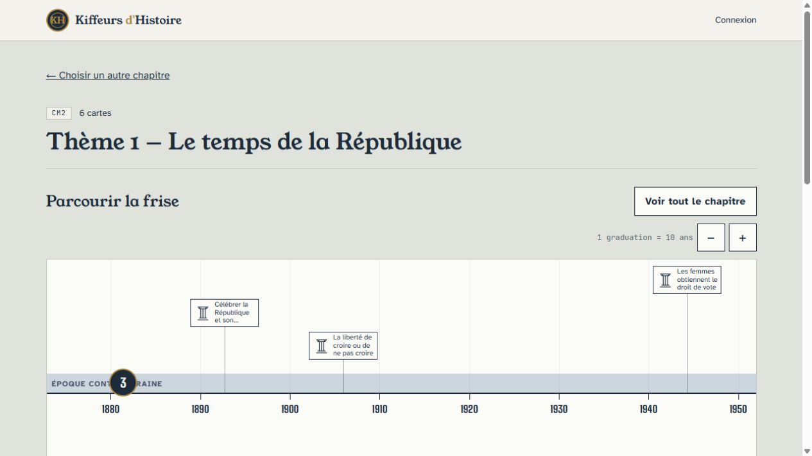
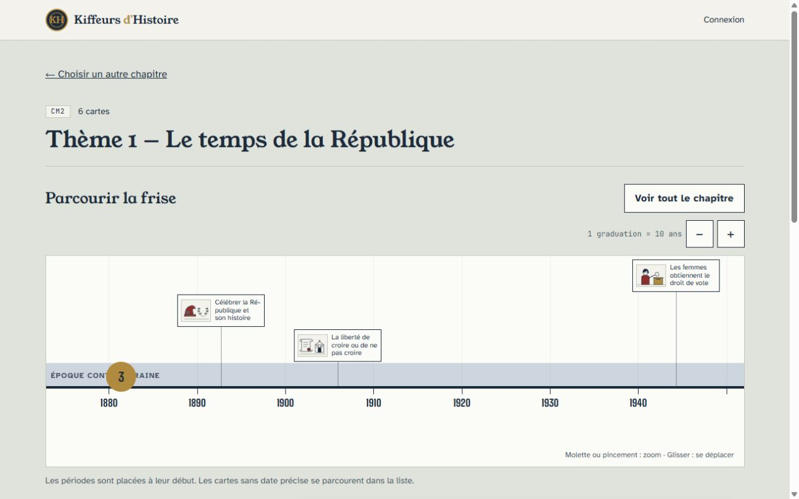
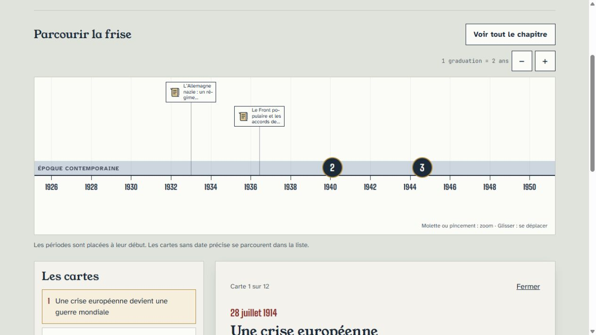
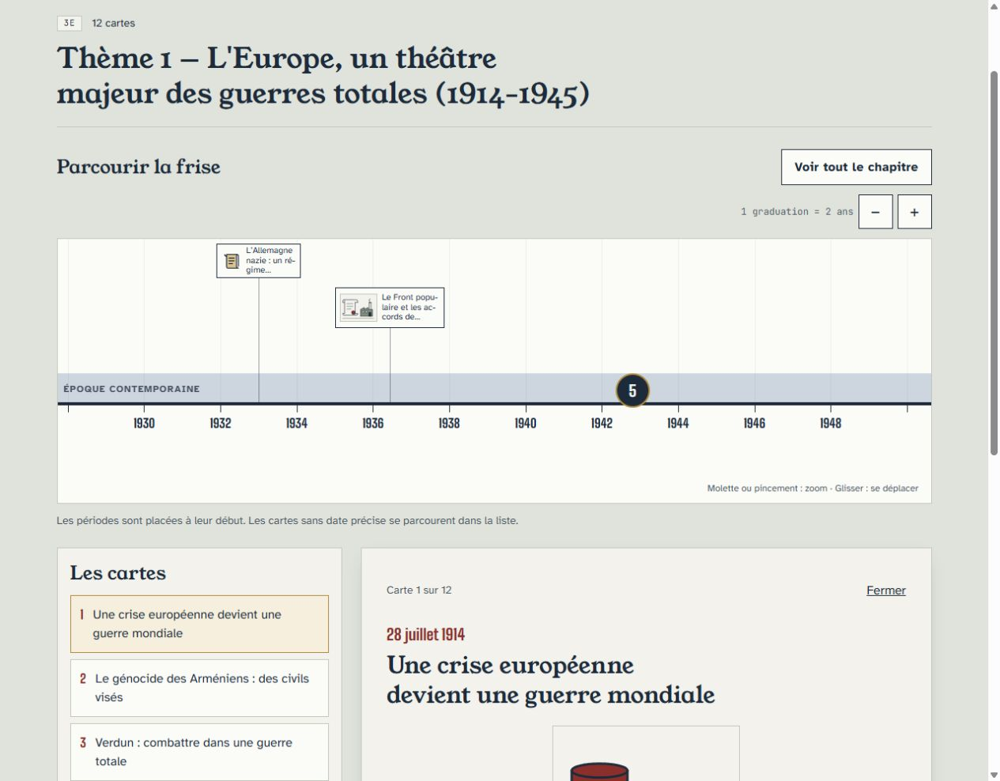
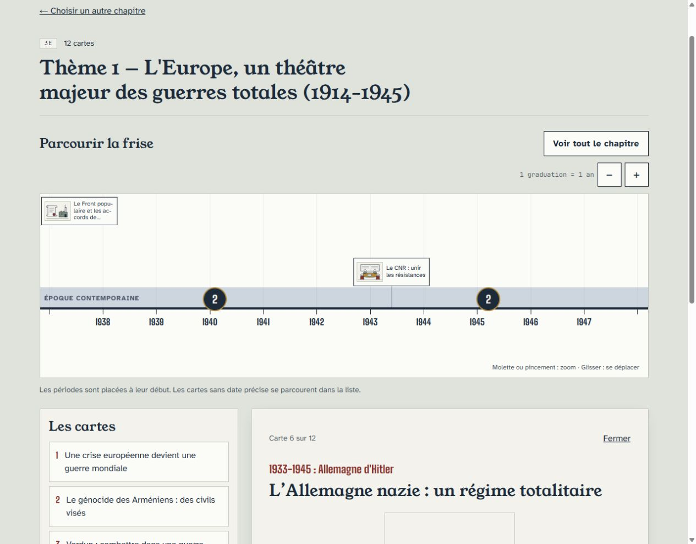
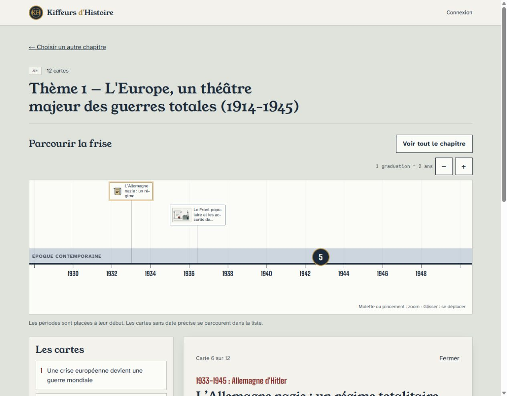
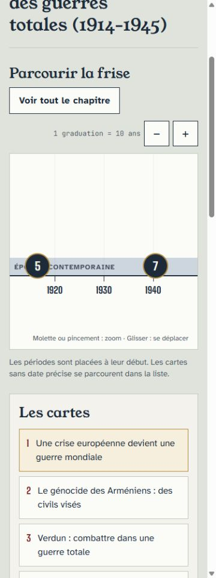
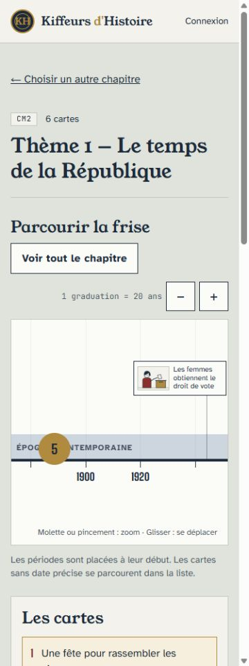
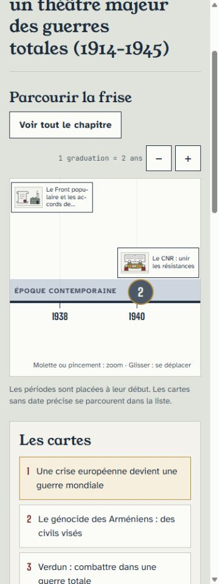

# Relecture des miniatures de la frise — #68

Les captures « avant » proviennent de `main` après #67 (`7c01b52`), avant
modification. Les captures « après » utilisent le même stock et les mêmes
cartes, sur le build local de #68. Largeur desktop : 1 280 px ; mobile : 375 px.
La hauteur et le défilement des captures peuvent différer. Aucun SVG redessiné.
Pendant #68, `main` a aussi intégré #18 / PR #62 (`497df65`). La branche a été
rebasée sur ce commit. Les changements partagés de Max restent intacts ;
les dimensions ci-dessous distinguent ce `main` de la variante pédagogique.

## Dimensions retenues

| Élément | Autres frises (`main` courant) | Variante `/apprendre` |
| --- | --- | --- |
| Marqueur dédié | 128 × 52 px, motif | 140 × 52 px |
| Image dédiée | — | 48 × 36 px, entière, `object-fit: contain` |
| Fallback | motif 28 × 28 dans 128 × 52 px | motif 28 × 28 dans 108 × 44 px, comme au début de #68 |
| Seuil de regroupement | 132 px | 144 px |
| Couloirs | 10 / 62 / 114 px | 6 / 62 / 118 px |
| Axe / bandes des périodes | 209 / 172 px | identiques au `main` courant |

Papier, filet fin et encre restent ceux de la charte. Le titre est limité à
trois lignes comme auparavant ; le bouton fournit toujours le titre complet
et la date aux technologies d'assistance. Le filet laiton indique la carte
active, y compris lorsqu'elle appartient à un groupe.

## Comparaisons

CM2, THM-001, cadrage initial : mêmes cartes, miniatures dédiées à droite du
groupe. Comparer les cartels de 1892, 1905 et 1944.

3e, THM-016, après ouverture du groupe des années 1933–1945 : le motif de
« L'Allemagne nazie » reste présent. La vue rapprochée suivante montre aussi
le CNR et les groupes de dates proches. Les marges de zoom sont ajustées : les
captures denses ne promettent pas une caméra strictement identique.

Mobile : l'avant montre THM-016 au cadrage initial ; l'après montre THM-001
avec une miniature entière, puis THM-016 après plusieurs clics de zoom sur
les groupes. Les images gardent la même taille, sans réduction mobile.

## Vérifier dans la preview

1. Ouvrir `/apprendre/cm2/thm-001-theme-1-le-temps-de-la-republique` : comparer
   les trois miniatures au stock validé et cliquer « Les femmes obtiennent le
   droit de vote ». Vérifier le panneau et le filet actif.
2. Ouvrir `/apprendre/3e/thm-016-theme-1-l-europe-un-theatre-majeur-des-guerres-totales-1914-1945`.
   Cliquer les groupes successifs pour séparer les cartes. « Allemagne nazie »
   garde son petit motif de chapitre. Si elle sort du cadre, la sélectionner
   dans la liste pour la recentrer, puis cliquer son marqueur.
3. Répéter à 375 px : le groupe initial de 12 se déplie en plusieurs clics,
   la miniature ne se coupe pas, les titres restent lisibles, les boutons de
   zoom et le glissement fonctionnent. Vérifier le pincement sur un appareil
   tactile (gestes également couverts par le test de pointeurs).
4. Vérifier THM-014, printemps des peuples et abolition en 1848 : les dates
   proches restent regroupées puis accessibles individuellement en zoomant.
5. Ouvrir `/demo/frise` et `/demo/saisie` : aucune miniature nouvelle, motifs
   et géométrie compacte conservés. Le code de l'écran de partie #18 est intact.

La validation humaine finale porte sur la taille des miniatures et la
lisibilité des cartels. La PR reste ouverte, sans fusion automatique.

## Contrôles effectués

- 82 vues de chapitre dans Chromium (41 desktop + 41 mobile) : 325 cartes
  présentes à chaque format, aucun débordement, cartel coupé ou chevauchement
  au cadrage initial. Mesures dans [mesures-chapitres.json](mesures-chapitres.json).
- THM-016 après plusieurs zooms : miniatures, groupes, fallback, sélection et
  clic relus ; glissement réel dans Chromium, gestes tactile/pincement testés.
- 303 illustrations disponibles / 22 fallbacks, calculés côté serveur avec la
  même validation que l'API. Sur la frise, 290 cartes dédiées et 13 fallbacks
  sont datés. Les 22 sans date structurée restent dans la liste et le panneau
  (13 dédiées, 9 fallbacks), sans date inventée.
- 41 HTML/RSC statiques vérifiés, cache ISR 3 600 s, 331 SVG tracés pour l'ISR.
  325 réponses SVG/fallback exactes et trois refus 404, sans identifiants ou
  chemins internes. Aucun changement des CSV, SVG, migrations ou écrans #18.
- Suite complète Vitest et 6 tests d'import, lint, typecheck et build verts ; build
  effectué avec la fixture RPC anonyme locale, sans lecture/écriture distante.
  L'avertissement existant de fallback de police Big Shoulders persiste.
